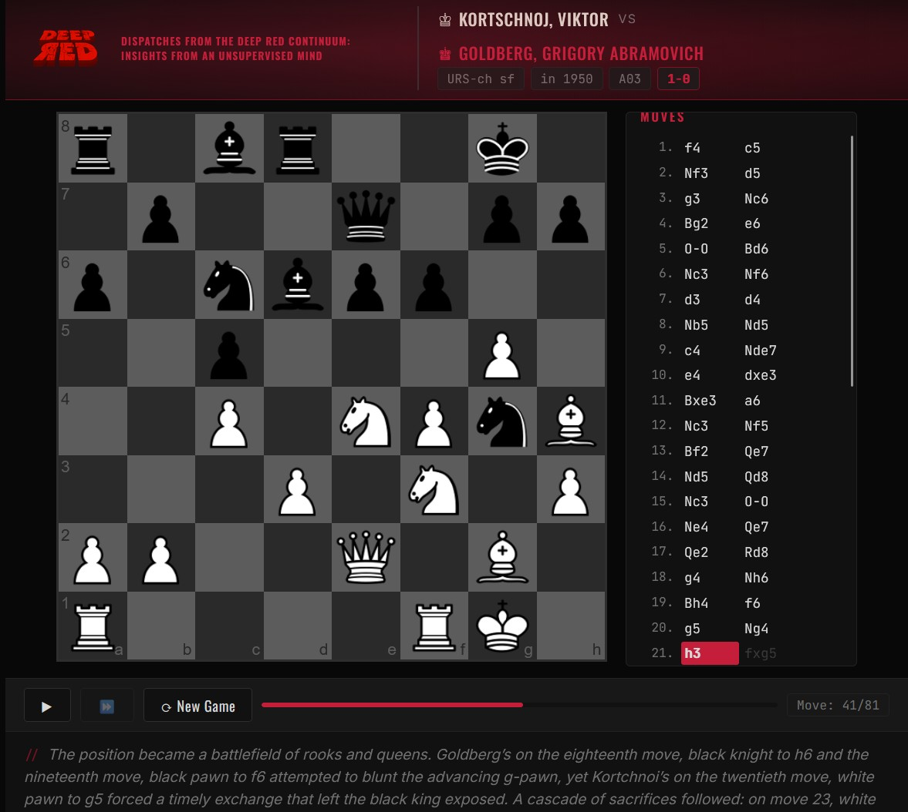

# DEEP RED Stories

<p align="center">
  
</p>

A static web application that replays historical chess games with synchronized AI-generated audio commentary. A deep-voiced, Russian-accented narrator guides the viewer through each game move by move. 

Are you ready to learn from DEEP RED, the AI governing the perfect Martian utopia of New Moscow, built from an old Soviet chess computer, and with the brilliant insights of an uncontrolled machine.

<p align="center">
  <a href="https://ferzkopp.net/DeepRedStories/">♚ Visit DEEP RED Stories</a>
</p>

## Quick Start

```bash
cd DeepRedStories
py -3.11 -m venv .venv
.venv\Scripts\activate
pip install -r pipeline/requirements.txt
```

Run the pipeline to generate audio, then serve the web app:

```bash
python pipeline/prepare_data.py
python pipeline/generate_audio.py --resume
python -m http.server 8000 --directory web
```

## Documentation

| # | Document | Description |
|---|----------|-------------|
| 1 | [Project Overview](docs/01-project-overview.md) | Architecture, source data, directory structure, key decisions |
| 2 | [Pipeline Setup](docs/02-pipeline-setup.md) | Prerequisites, Python environment, dependencies |
| 3 | [Running the Pipeline](docs/03-running-the-pipeline.md) | Data preparation, audio generation, resume & options |
| 4 | [Web Application](docs/04-web-application.md) | Serving the site, controls, data format |

## Project Structure

```
DeepRedStories/
├── docs/                 # Documentation
├── pipeline/             # Offline data & audio generation
│   ├── input/            # Source JSONL files (read-only)
│   ├── output/           # Generated game data & audio (gitignored)
│   ├── prepare_data.py   # Phase 1: data joining, sampling & parsing
│   ├── generate_audio.py # Phase 2: TTS audio generation
│   └── requirements.txt
├── web/                  # Static web application
│   ├── index.html
│   ├── css/
│   ├── js/
│   ├── img/
│   └── data/             # Copied from pipeline/output/
└── scripts/              # Build & deploy helpers
```
